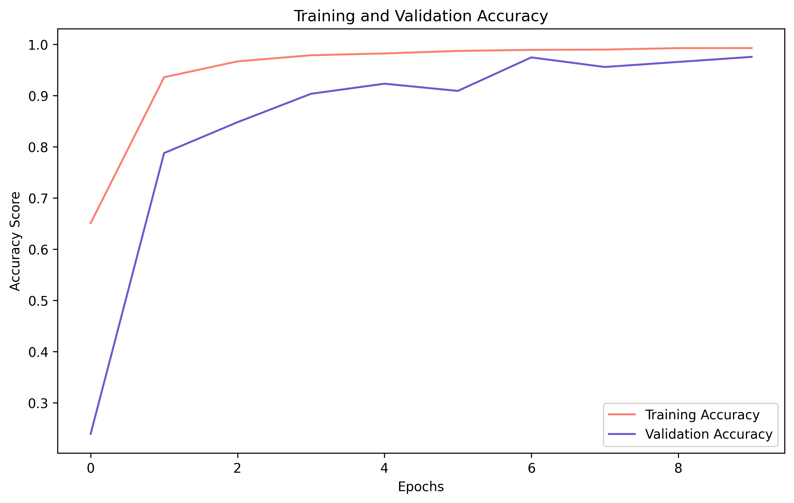
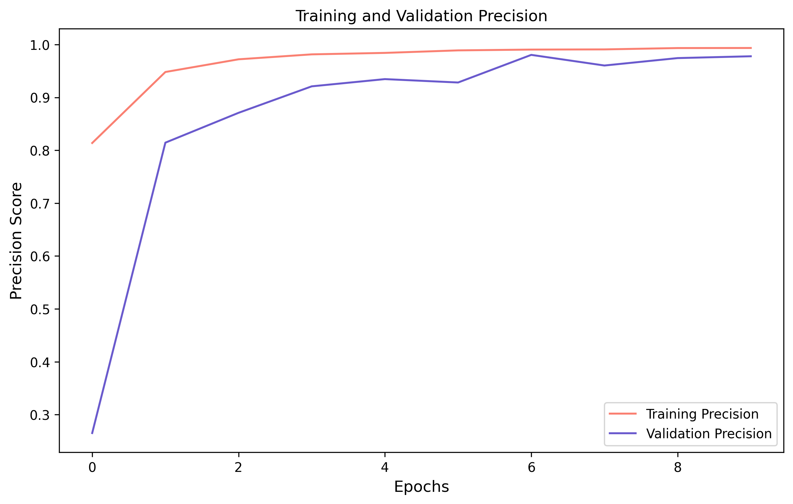

## Multiclass Classification of Protein Molecular Function 

### Table of Contents

**File Name**|**File Order**|**File Description**
:-----:|:-----:|:-----:
README.md|1|The README file contains the executive summary and overview of the project as a whole.
data|2|File directory contains all of the data used in the notebooks.
data-cleaning.ipynb|3|Contains the data cleaning and class creation sections of the project. 
protein-eda.ipynb|4|Contains all exploratory data analysis done on the dataset.
colab-modeling-rnn.ipynb|5|Contains all iterations of recurrent neural net models trained on the imbalanced data.
oversample_model_rnn.ipynb|6|Contains all iterations of recurrent neural net models trained on oversampled data. 
images|7|A directory containing images of scores from the final production model and data analysis visualizations used in the executive summary.
capstone_presentation.pdf|8|A pdf containing the powerpoint slides used during project presentation.
capstone_streamlit.py|9|Python script for creating model demo to use during the presentation.
rnn_model_sampled_2.h5|10|The saved model architecture and weights for use in the streamlit script.
requirements.txt|11|The package requirements needed to read the notebooks.

#### The Problem
Proteins are macromolecules which perform essential functions in basically every process of living cells. To name a few major processes: proteins replicate DNA, synthesize other proteins, and control the production of cellular energy in the form of ATP and cellular division. Though proteins are so essential to life, the process of discovering their function and structure is time consuming. Techniques such as x-ray crystallography and functional assays are resource-demanding and low-output compared to the high output of next-generation DNA sequencing (NGS) techniques.

Currently, there are several tools used to attempt to match a novel protein sequence with known protein sequences in an attempt to extract information about the novel sequence's origin or function. Such tools, such as BLAST, use sequence alignment to determine homology and sequence similarity to known proteins. If two protein sequences have high sequence similarity it is strong evidence they are closely related through evolutionary history and have a common ancestor sequence. When two proteins are considered evolutionary related, they are considered homologous and likely have conserved/homologous sequence regions, which can be matched in BLAST searches. However, proteins with similar function, which are not evolutionarily related or have come to similar function through convergent evolution, may not be matched as they lack sequence similarity and homology.

As DNA sequence data continues to expeditiously grow, it would be highly beneficial to match pace of protein function identification with sequencing. Using natural language processing techniques, I strove to determine if there is a potential for use of artificial intelligence in rapid protein function identification - away from solely homology or sequence alignment techniques.  

#### The Solution
Each amino acid, the monomers which bind together to form the peptide sequence of a protein, has slightly differing chemical properties, which interact during protein folding to create the structure of the protein. Ultimately, the structure of the protein determines the function of the protein and thus means the amino acid sequence determines the function of the protein.

As the sequence of a protein can be represented as single-letter amino acid code, I surmised natural language processing techniques might be used to extract complex features of amino acid sequences which are connected to specific protein functions. After creating 8 classes of differing molecular functions, I harnessed the predictive power of a recurrent neural network, an aritificial intelligence algorithm, to help identify the function of the protein with high predicitve power.

#### Evaluation Metrics
As an individual, I am both a biochemist and data scientist. This allowed to me apply domain knowledge to both of these fields to obtain a multiclass classifier which performed above the null model in both accuracy and the f1-score in predicitve power. The null model, a starting point to compare the performance of future models to, is one that will predict the most frequently occuring class in the training set. The most frequently occuring class, ATP Binding, would grant the null model an accuracy of 49.4%. The final production model was the RNN which scored the best on a pair of evaulation metrics: balanced accuracy and f1-score.

Balanced accuracy is an important metric for the RNN because the model should be able to classify all classes with a high predictive power. As the data contained severly imbalanced data, I wanted to make sure the underrepresented classes were also being correctly classified and that the evaluation metric wasn't being dominated by the more frequently occuring classes. The f1-score was also important, as I wished to seek a balance between the precision and recall of the models - neither precision nor recall seemed more important than the other. The f1-score for the models were determined with the weighted average, as the data set contained severly imbalanced classes.

#### Data & Preprocessing
The data for this project was acquired from [UniProtKB](https://www.uniprot.org/uniprot/), a freely-accesible resource for protein sequences and annotated molecular functions. The main mission of UniProt is to maintain and collect a comprehensive and consistently high-quality protein database for researchers and scientists across the globe. The data is easily acquired from UniProt, as it is available for download to your local machine in a variety of file types. UniProt mainly uses the GO (Gene Ontology) covention for identifying and classifying protein functions into hierarchies. As such, each molecular function a protein had could be identified by a unique GO identification number. 

For this project, I only took protein sequences from SwissProt - the database of manually reviewed and annotated proteins which have undergone "curator-evaluated computational analysis". I wanted the protein sequences used to train the model to be annotated and reviewed, as opposed to unreviewed. After acquiring the data, I was quick to discover that the molecular function of a protein could be accurately verbose; ultimately creating 28,473 unique values for 404,840 observations. In order to reduce the scope of this project and to train the model towards classes with an abundance of data, the proteins were grouped into more general classes. After analyzing some of the more common GO molecular functions, I created 8 classes of differing GO hierarchical levels. These classes are broken down below:

**Class Name**|**Class Number**|**Number of Observations per Class**
:-----:|:-----:|:-----:
rRNA Binding [GO:0019843] & Structural Constituent of the Ribosome [GO:0003735]|1| 20,054
DNA Binding [GO:0003677]|2| 24,783
ATP Binding [GO:0005524]|3| 64,687
Hormone Activity [GO:0005179]|4| 1,515
GTPase Activity [GO:0003924]|5| 5,747
NADH Dehydrogenase (Ubiquinone [GO:0008137]  & Quinone [GO:0050136] Activity)|6| 4,241
Oxidoreductase Activity [GO:0016491]|7| 3,247
Toxin Activity [GO:0090729]|8| 6,707

#### Final Production Model
The final production model consisted of the following recurrent neural network architecture: embedding layer, three convolutional layers for feature extraction, a bidirectional GRU layer, and two hidden layers of 160 and 80 nodes, respectively.The output layer activation was 'sigmoid', as there is class overlap the final model was trained as a multi-label classifier. The final model scored approximately 94.3% on balanced accuracy and 95.7% on f1-score. This model was chosen as the final because it produced the highest pair-wise scores on balanced accuracy and f1-score.

The visualization below shows how the accuracy of the training data and validation data changed as the final production model was trained over 10 epochs. As the RNN model continued to train over each epoch, we can see that the training accuracy continued to go increase - as the model became more and more specifically trained to that set of data. The validation/testing accuracy, however, plateaued at around 96% accuracy. 

The next visualization, shown below, graphs how the precision score of both the training and testing/validation data changed over the 10 epoch training period. Similarly to the accuracy graph above, the training precision continued to climb, as the RNN model became more trained on that set of data. Also similarly, the precision score of the testing/validation data plateaued, in almost the exact same pattern as accuracy, at approximately 96%.  

#### The Conclusion
The endeavor to determine if single-letter amino acid sequence, the primary structure of the protein, could be used to predict the molecular function of a protein was successful. The recurrent neural network was able to predict between the eight class of molecular function with a rate of success well above the null model for balanced accuracy and f1-score, which suggests a high predictive power for future model iterations going forward. 

Though this model performed well, it continued to have difficulties predicting between certain classes, namely ATP binding, DNA binding, and Oxidoreductase. This speaks towards the multi-faceted nature of proteins represented in the classes chosen. Due to the way I broke down the classes, there existed class overlap, mainly between the larger ATP binding and DNA binding classes, which contributed to the misclassifications occuring between these classes. In total, there were 4,296 proteins which had both ATP binding[GO:0005524] and DNA binding[GO:0003677] capabilities. Therefore, while this model could be used to predict molecular functions, it is not a comprehensive nor multi-faceted predictor.

The model created does not encompass all molecular functions of proteins: the way classes were separated meant some molecular functions are not represented in this model. The model is merely a starting point to determine if this data type and artificial intelligence techniques are viable for achieving a high predictive power.

#### Recommendations
I recommend using this model to narrow the scope of experimentation required to determine protein function. This will increased expediency of function discovery and begin to close the gap between NGS and protein function/structure identification.

#### Improvements
In order to improve this model, it would be advisable to identify and employ class break down towards a single hierarchical level. This would make model predictions more robust, as a number of classes encompassing a fuller view of molecular function would be implemented in modeling. Also, it would be beneficial to continue training the model as a higher number of annotated and reviewed protein sequence data is released. A potential contributing factor towards the higher number of misclassifications in the Hormone and Oxidoreductase class is that these classes only were represented by 1.1% and 2.4% of the total observations, respectively. Though oversampling was done to bridge the gap between the imbalance in classes, the original majority classses contained a more variable spread of amino acid sequence observations to train on. Overall, the minority classes of the data, with less variable sequences to train with, will still have trouble generalizing to new and variable sequence data. 

